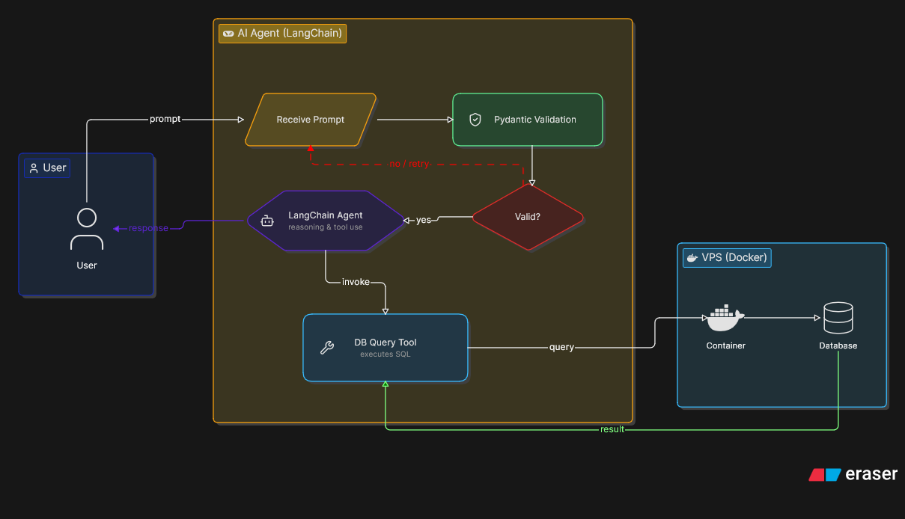

# DataQuery-AI

## 📖 Overview

**DataQuery-AI** is an AI-powered ReAct (Reasoning + Acting) agent that interacts with a MySQL database to answer user questions using natural language.

Instead of requiring users to write SQL queries, the agent understands the user's request, reasons about the required steps, executes SQL queries against the database as a tool, and returns a clear, human-readable response.

## Environment Variables

To run this project, you will need to add the following environment variables to your .env file

`MISTRAL_API_KEY`
`MYSQL_PORT`
`MYSQL_HOST`
`MYSQL_PASSWORD`
`MYSQL_USER`

## Authors

- [@hamdane1548](https://github.com/hamdane1548)

## How It Works

- The user submits a question in natural language.
- The ReAct AI agent analyzes and reasons about the request.
- The agent decides whether it needs to query the MySQL database.
- It generates and executes the appropriate SQL query.
- The database returns the requested information.
- The AI formats the results into a natural language response for the user.
## Tech Stack

**Tech:** : Langchain , python , Mysql, Pydantic , docker
FastAPi  , docker
## 📚 Lessons Learned

One of the biggest lessons from this project is that **an LLM should never be trusted to execute SQL directly**.

To build a secure AI database agent:

- Validate and sanitize the user's input.
- Validate the SQL generated by the LLM before execution.
- Allow only safe queries (e.g., `SELECT`).
- Use parameterized queries whenever user values are included.
- Filter sensitive data from the output.
- Use a read-only database account with the minimum required permissions.

> **Security first:** Never execute user input or LLM-generated SQL without validation.